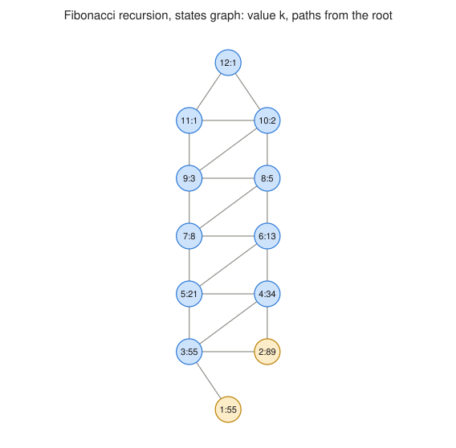

# Multiway Register Machines

An open-source, Mathematica-free implementation of multiway register machine
evolution, with a browser explorer, exact analysis tools, and reproducible
figures. Companion code for the paper "State Evolution in Multiway Register
Machines Featuring Applications to Recursive Functions" and the Wolfram
Function Repository resource
[MultiwayRegisterMachine](https://resources.wolframcloud.com/FunctionRepository/resources/MultiwayRegisterMachine/).

**Live explorer:**
[mathmaster1296.github.io/multiway-register-machines](https://mathmaster1296.github.io/multiway-register-machines/)



## What a multiway register machine is

A register machine holds non-negative integers in a few registers and runs a
program of increment and decrement instructions, where a decrement on an
empty register takes a separate fail branch. A multiway register machine
makes one change: an instruction may list several jump targets instead of
one. The machine no longer has a single next state, so evolution produces a
graph of every reachable configuration rather than a sequence.

Two views of that evolution matter. The tree keeps every computational path
separate, so it grows as fast as the paths multiply. The states graph merges
configurations that coincide, which can collapse an exponential tree into
something small while the number of distinct paths through it stays
exponential. The Fibonacci model below is the sharpest example: at k = 20
the states graph is a line of 20 nodes, and the number of paths through it
to the base cases is F(20) = 6765.

## Parity with the Wolfram original

The engine was ported from the published source of the WFR resource, and its
behavior is pinned by golden tests to the evaluated outputs recorded in the
resource's definition notebook and the research notebook: frontier lists to
depth 15, state graphs up to 71 nodes with identical node numbering and edge
order, complexity values to full double precision, the Collatz trajectory of
101, and the paper's Fibonacci and polynomial machines. Every place the
original left semantics implicit is written down in
[ASSUMPTIONS.md](ASSUMPTIONS.md), and
[docs/porting-notes.md](docs/porting-notes.md) maps each Wolfram function to
its Python equivalent.

## The models

Three models carry closed-form invariants that `mrm verify` checks against
the engine's own output:

* Grid paths: walk from (0, 0) to (m, n) by unit steps. The path count to
  the terminal must be binomial(m + n, m); the suite checks all m, n up
  to 8.
* Fibonacci recursion: k branches to k - 1 and k - 2 with base cases at 1
  and 2. The path count to the base cases must be F(k), checked for k up
  to 20.
* Collatz, in three flavors: the paper's multiway machine, which explores
  both the 3n + 1 and the halving section at every branch point; a
  deterministic variant whose parity test is expressed as modular guard
  rules; and a reverse machine that grows the Collatz tree upward from 1.
  The suite checks trajectories against the arithmetic map and the reverse
  tree against forward return.

The paper's own machines ship as presets too: the polynomial evaluator built
from `power`, `scalar`, and `add`, the Fibonacci adder, and the notebook's
halting, non-halting, and complete-graph examples.

## Install and use

```bash
pip install git+https://github.com/MathMaster1296/multiway-register-machines
```

```python
from mrm import Config, evolve, terminal_path_counts, absorption
from mrm.builders import grid_paths_machine

ev = evolve(grid_paths_machine(3, 3), Config(1, (0, 0)))
terminal_path_counts(ev)          # {16: 20}
absorption(ev).expected_steps     # Fraction(6, 1), exactly
```

The command line covers the common tasks:

```bash
mrm run fibonacci --analyze        # evolve a preset, with exact halting stats
mrm verify                         # all model invariants, nonzero exit on failure
mrm export ev.json --format dot    # DOT, GraphML, WL, or evolution JSON
mrm figure all --out figures       # regenerate every figure, byte-identical
```

The core package needs Python 3.10+ and nothing else: no NumPy, no graph
library, no Mathematica. The formal model, written for a referee, is in
[docs/semantics.md](docs/semantics.md).

## Beyond the original

Some analyses here go further than the WFR resource:

* Exact absorption analysis. Treating each applicable rule as equally
  probable turns the states graph into a Markov chain; `mrm.absorption`
  solves it in rational arithmetic and reports the probability of halting in
  each terminal, the probability of running forever, and the exact expected
  number of steps. The WFR probability plots are the transient face of the
  same chain, and `mrm.probability_table` reproduces those tables as exact
  fractions.
* Path counting with an honest infinity. Counts respect rule multiplicity,
  and on cyclic graphs affected nodes report an explicit infinite sentinel
  along with a concrete cycle witness instead of a wrong number.
* Branchial graphs and reconvergence. `mrm.branchial_graph` connects
  same-layer states that share a parent, and `mrm.reconvergence` measures
  how often the two sides of a branch meet again, which is the property that
  decides whether state merging pays off.
* Deterministic layout. Figures come from a fixed-pass layered layout with
  no randomness, so the same evolution always renders to the same bytes.

## Repository layout

Machines serialize to a versioned JSON format
([docs/machine.schema.json](docs/machine.schema.json)); presets under
`src/mrm/presets/` are plain files in that format, so adding a model needs no
code. Evolutions serialize with their parameters, derived data, and a hash
of the machine that produced them
([docs/evolution.schema.json](docs/evolution.schema.json)).

## The explorer

The site under `web/` is static and framework-free. It does not reimplement
any mathematics in JavaScript: a Web Worker loads Pyodide, installs the same
`mrm` wheel that CI builds, and every run on the page goes through the exact
code in this repository, so the site and the paper cannot disagree. The
first visit downloads the Python runtime (a few megabytes, cached
afterwards); everything after that is local and works offline.

The page keeps the full machine and every evolution setting in the URL,
compressed, so any view can be cited by link and reproduced exactly. Step
playback reveals the evolution layer by layer, branch highlighting shows a
state's ancestors and descendants, and the current view exports as SVG, PNG,
or evolution JSON. Graphs under 2000 nodes render as interactive SVG and
larger ones fall back to a canvas.

To work on it locally: `npm install && npm run build` inside `web/`, build a
wheel with `python -m build`, then `python scripts/build_site.py` and serve
`web/dist` with any static file server.

## License

MIT. See [LICENSE](LICENSE).
